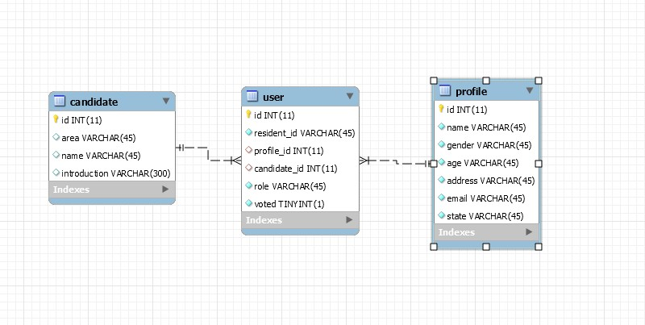

## Terminal Commands

1. Install Java8+, MySQL database
2. Create Schema and tables in the MySQL database followed ER diagram

3. change configuartoin in the application.properties to connect with database
3. Go to your file project
4. Run DemoApplication.java to start server
